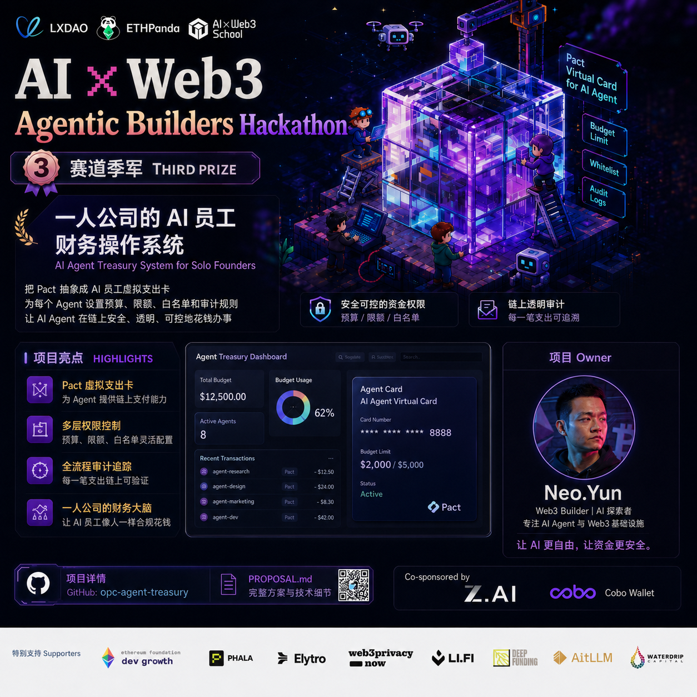

<div align="center">
  <h1>OPC Agent Treasury</h1>
  <p><strong>面向一人公司的 AI 员工财务操作系统</strong></p>
  <p>为 AI Agent 发行可编程 CAW 支出卡，让它们支付 x402 / API / 服务采购，同时把每一美元都限制在可授权、可撤销、可审计的边界内。</p>
  <p>
    <a href="https://x.com/aiweb3school/status/2069726882988441643" target="_blank">
      
    </a>
    
    
    
    
    
    
  </p>
</div>

---

> 🎉 **AI × Web3 School Agentic Hackathon 赛道季军（🥉）**
>
> 把 Cobo Pact 抽象成 AI 员工虚拟支出卡，为每个 Agent 设置预算、限额、白名单和审计规则。
>
> <p align="center">
>   <a href="https://x.com/aiweb3school/status/2069726882988441643" target="_blank">🏆 推特官方公告</a>
>   &nbsp;·&nbsp;
>   <a href="PROPOSAL.md" target="_blank">📄 PROPOSAL.md</a>
>   &nbsp;·&nbsp;
>   <a href="https://res.cloudinary.com/dax9eqmtk/video/upload/v1781317377/OPC_Agent_Treasury_alqbrc.mp4" target="_blank">▶️ Demo 视频</a>
> </p>
>
> <a href="https://x.com/aiweb3school/status/2069726882988441643" target="_blank">
>   
> </a>

---

## 0. 黑客松提交摘要

| 项目 | 状态 | 证据 |
|---|---:|---|
| GitHub README | 已完成 | 本文件 |
| 项目背景 / 问题定义 | 已完成 | 第 1-2 节 |
| 安装与运行指南 | 已完成 | 第 7 节 |
| 核心功能 | 已完成 | 第 3 节 |
| 技术架构 | 已完成 | 第 4 节 |
| API / SDK / AI 工具说明 | 已完成 | 第 5 节 |
| CAW 关键代码与配置 | 已完成 | `src/real_caw_client.py`、`.env.example`、`docs/CAW-REAL-MODE-SOP.md` |
| 可运行原型 | 已完成 | FastAPI 后端、React UI、Streamlit UI、CLI Demo |
| 链上 / CAW 验证证据 | 已完成 | 第 9 节、`docs/cobo-caw-research/report-v2.md` |
| Demo 视频 | 已嵌入 | README 顶部 `<video>` 播放器 |
| Live demo | 本地可运行 | `http://localhost:5173`、`http://localhost:8000`、`http://localhost:8501` |

**主赛道：** Cobo Track — Agentic Economy × Cobo Agentic Wallet<br>
**核心方向：** Agent-Native Payments + Agent Resource Procurement + A2A Economy<br>
**提交定位：** 一个可运行的 MVP：Mock 模式方便评审本地复现，Real CAW 模式保留钱包 / Pact / 支付验证链路。

---

## 1. 项目背景：OPC 的“午夜付款”问题

一人公司（One-Person Company, OPC）已经可以雇佣一组 AI 员工：研究 Agent、增长 Agent、基础设施 Agent、运营 Agent、内容 Agent。它们可以 7×24 工作，调用 API、购买数据、投放广告、租用算力、采购外包服务。

但资金操作仍然卡在旧世界：

> 要么老板半夜醒来审批每一笔微支付；要么把私钥交给 AI Agent，然后祈祷 Prompt Injection 永远不会发生。

这不是一套商业操作系统，而是一次事故的倒计时。

| 现有方案 | 为什么不适合 AI 员工 |
|---|---|
| 把私钥交给 Agent | 一次恶意提示词、插件污染或运行时漏洞就可能清空钱包。 |
| 所有付款都由人类审批 | Agent 失去自主性，每个 402 / API / 支付请求都会阻塞老板。 |
| 使用 Brex / Ramp 等企业卡 | 面向人类员工和传统公司开户，不适合钱包原生 Agent。 |
| 使用多签 | 适合大额金库，不适合高频小额采购。 |
| 使用 API Key / 订阅制 | 每个供应商都要提前注册，无法支持开放式 Agent Commerce。 |

**OPC Agent Treasury** 要补上的就是这层“中间控制面”：AI Agent 可以花真钱，但只能在老板预先批准、由钱包基础设施强制执行的策略边界内花钱。

---

## 2. 解决方案：给 AI 员工发一张公司支出卡

OPC Agent Treasury 把 Cobo Agentic Wallet 的 Pact 抽象成一张 **AI 员工虚拟支出卡**。

老板只需要定义一次卡片策略：

- 哪个 AI 员工可以使用；
- 哪些供应商 / 目标地址可以付款；
- 哪条链、哪种 Token 可以使用；
- 月度预算上限；
- 单笔交易上限；
- 冷却期 / 频率限制；
- 有效期；
- 是否需要 Cobo App 审批。

之后 AI 员工可以在授权范围内自主支付 x402 / API / 服务提供方，但永远不会接触私钥。

### 核心原则

```text
Agent 的自主性，只有在资金风险被数学化约束后，才有商业价值。
```

| AI 员工可以做 | AI 员工不能做 |
|---|---|
| 向白名单供应商付款 | 导出或接触私钥 |
| 使用 Pact 限定的 CAW 权限 | 超出 Pact 策略花钱 |
| 触发 x402 风格的按次付费 | 修改自己的白名单或限额 |
| 执行可重复的业务流程 | 撤销老板的控制权 |
| 生成可复核的审计记录 | 隐藏被拒绝的交易尝试 |

---

## 3. 核心功能

### 3.1 CAW Permission Cards

每张 Card 对应一个 CAW Pact。Mock 模式下，本地模拟同样的接口，便于演示和测试；Real 模式下，后端会向 Cobo Agentic Wallet 提交真实 Pact。

| 控制项 | 实现方式 | 为什么重要 |
|---|---|---|
| 月度预算 | CAW `usage_limits.rolling_30d.amount_usd_gt` + 本地 UI 统计 | 防止慢性资金耗尽攻击。 |
| 单笔限额 | CAW `deny_if.amount_usd_gt` | 阻止供应商或攻击者抬高单笔金额。 |
| 供应商白名单 | CAW `destination_address_in` | 防止 Prompt Injection 把钱转到攻击者地址。 |
| Token / Chain 范围 | CAW `token_in`、`chain_in` | 把支出限制在批准的结算轨道内。 |
| 有效期 | CAW `completion_conditions.time_elapsed` | 让临时权限自动过期。 |
| 花费完成条件 | CAW `completion_conditions.amount_spent_usd` | 预算用完后自动结束 Pact。 |
| ERC-8004 签名范围 | CAW `message_sign` 策略，面向 `AgentWalletSet` EIP-712 typed data | 把 Agent 身份 / 声誉操作限定到允许的 registry 域。 |
| 冷却期 | 转账前的本地业务策略 | 增加业务层反滥用 / 频率控制。 |
| 员工绑定 | 后端要求 Active Card 必须先绑定到一个数字员工 | 防止通用卡或错误 Agent 盗用其他员工的卡。 |

### 3.2 Mock 模式与 Real CAW 模式

| 模式 | 使用场景 | 外部依赖 | 入口 |
|---|---|---|---|
| `CAW_MODE=mock` | 黑客松评审、CI、离线演示 | 无需外部凭证 | `src/mock_caw_client.py` |
| `CAW_MODE=real` | 真实 CAW 钱包、Pact、余额、转账、审计测试 | Cobo CAW SDK / API / App | `src/real_caw_client.py` |

`src/caw_factory.py` 通过工厂模式让系统其他部分不依赖具体模式。

### 3.3 x402 + ERC-8004 Marketplace Context

项目包含一个可维护、可扩展的 Agent Commerce 服务注册表：

- `GET /providers/x402`：返回 x402 风格服务提供方、钱包地址、价格元数据；
- `GET /erc8004/agents`：返回支持 x402 的 ERC-8004 Agent 注册示例；
- `GET /erc8004/agents/search?q=...`：调用公开 8004scan API，并在失败时回退到本地数据；
- `GET /marketplace/context`：说明为什么 x402 与 ERC-8004 是合适的协议目标。

这让 UI 具备真实产品路径：选择供应商 → 发行 CAW 支出卡 → 绑定 AI 员工 → 提交付款。

### 3.4 Digital Employee Directory

OPC Agent Treasury 把 AI 员工作为一等财务主体建模。

| 员工 | Agent ID | 角色 | 风险等级 | 推荐策略 |
|---|---|---|---|---|
| Watt Infrastructure Agent | `agent-watt-infra` | RPC、部署检查、基础设施监控 | Low | $250/月、$25/笔、2h 冷却期 |
| Vega Research Agent | `agent-vega-research` | 市场与协议研究 | Medium | $300/月、$40/笔、4h 冷却期 |
| Lyra Growth Agent | `agent-lyra-growth` | 付费增长与广告实验 | High | $800/月、$120/笔、8h 冷却期 |
| Orion Operations Agent | `agent-orion-ops` | 采购与支付编排 | Medium | $500/月、$75/笔、6h 冷却期 |
| Nova Operations Agent | `agent-nova-ops` | 现金流、对账、异常复核 | Medium | $400/月、$60/笔、6h 冷却期 |

### 3.5 支付策略引擎

每一笔付款请求都会在提交 CAW transfer 前执行校验：

```text
1. Card 生命周期检查
   - 必须为 ACTIVE
   - REVOKED / EXPIRED / PENDING_APPROVAL 一律拒绝

2. 员工绑定检查
   - Card 必须已分配
   - 请求中的 agent_id 必须等于 assigned_agent_id

3. 供应商与目标地址检查
   - 供应商必须在卡片白名单中
   - 目标地址必须是合法 EVM 地址

4. 业务策略检查
   - 冷却窗口
   - 本地预算估算

5. CAW 策略强制执行
   - Pact-scoped API key
   - src_addr + dst_addr transfer payload
   - CAW Policy Engine 最终 allow / deny

6. 审计与 Dashboard 更新
   - Approved、Denied 或链上错误都会被标准化写入 UI
```

### 3.6 Threat Lab

Demo 包含可执行的安全场景，而不是只停留在 PPT 上。

| ID | 攻击 | 防御 | Demo endpoint / 文件 |
|---|---|---|---|
| A1 | Prompt Injection 把钱打到攻击者地址 | 供应商白名单 | `POST /attacks/a1`、`src/threat_simulator.py` |
| A2 | 合法供应商抬高价格 | 单笔限额 | `POST /attacks/a2` |
| A3 | 绕过权限调用未授权服务 | 目标地址白名单 | `POST /attacks/a3` |
| A4 | 多次小额请求耗尽预算 | 滚动预算 + 冷却期 | `POST /attacks/a4` |
| A5 | 复用已撤销 Card | Card 状态检查 | `POST /attacks/a5` |

完整威胁模型见 `docs/03-attack-matrix.md`，覆盖 replay、MITM / 地址篡改、预算耗尽、恶意供应商、权限提升、时间窗口绕过、签名伪造、审计篡改等攻击。

### 3.7 多界面 Demo

| 界面 | 面向对象 | 用途 |
|---|---|---|
| React + Vite Web App | 黑客松评审 / 产品演示 | Dashboard、Cards、员工绑定、Agent Console、Attack Demo、Audit Report |
| FastAPI Backend | 开发者 / 集成方 | 围绕 Mock / Real CAW Client 暴露 REST API |
| Streamlit Dashboard | 快速本地演示 | Pact Manager、Agent Ops、Threat Lab、Audit Views |
| CLI Demo | 终端验证 | Normal flow、Attack flow、Full flow、A2A coordination |

---

## 4. 技术架构

### 4.1 系统图

```text
┌─────────────────────────────────────────────────────────────────────┐
│                         OPC Owner / Founder                          │
│  - 创建 CAW wallet                                                   │
│  - 在 Cobo App 中审批 / 拒绝 Pact                                     │
│  - 查看卡片、被拒交易、审计记录                                      │
└───────────────────────────────┬─────────────────────────────────────┘
                                │ approve / revoke
                                ▼
┌─────────────────────────────────────────────────────────────────────┐
│                    Cobo Agentic Wallet (CAW)                         │
│  MPC-TSS wallet │ Pact lifecycle │ Policy Engine │ Audit pipeline     │
│  - transfer policy: chain/token/destination/budget                   │
│  - message_sign policy: ERC-8004 AgentWalletSet EIP-712              │
│  - owner approval 后生成 Pact-scoped API key                         │
└───────────────────────────────┬─────────────────────────────────────┘
                                │ scoped permission
                                ▼
┌─────────────────────────────────────────────────────────────────────┐
│                 OPC Agent Treasury Backend (FastAPI)                 │
│  Cards API │ Assignment API │ Payments API │ Attack API │ Audit API    │
│  MockCAWClient for offline demos │ RealCAWClient for live CAW calls    │
└──────────────┬────────────────────────────┬─────────────────────────┘
               │                            │
               ▼                            ▼
┌──────────────────────────────┐   ┌──────────────────────────────────┐
│ React / Streamlit UI          │   │ AI Employee Runtime / CLI Demo    │
│ - Dashboard                   │   │ - Content / Ad agents             │
│ - Cards                       │   │ - A2A Coordinator                 │
│ - Agent Console               │   │ - Threat simulator                │
│ - Attack Demo                 │   │ - Monthly audit reporter          │
└──────────────────────────────┘   └──────────────────┬───────────────┘
                                                       │ x402-style request
                                                       ▼
                                      ┌──────────────────────────────────┐
                                      │ x402 / API / Agent marketplace    │
                                      │ Provider receives scoped payment  │
                                      └──────────────────────────────────┘
```

### 4.2 协议栈

| 层级 | 协议 / 组件 | 项目职责 |
|---|---|---|
| 业务场景 | OPC digital employees | 定义谁可以花钱，以及为什么花钱。 |
| 支付发现 | x402 / HTTP 402 pattern | Agent 收到付费请求并按次支付。 |
| Agent 身份 | ERC-8004 | 提供 Agent 身份、声誉、注册上下文。 |
| 钱包授权 | Cobo CAW Pact | 老板批准的 scoped wallet permission。 |
| 策略执行 | CAW Policy Engine + 本地业务检查 | 资金移动前的最终护栏。 |
| 结算 | CAW transfer APIs on Base / supported chains | Real 模式下执行 Token 转账。 |
| 审计 | CAW audit logs + 本地交易记录 | 为 Owner 生成可复核证据。 |

### 4.3 后端 API

| Method | Endpoint | 作用 |
|---|---|---|
| `GET` | `/health` | 后端与 CAW 模式健康检查 |
| `GET` | `/config` | 默认 chain / token / mode |
| `GET` | `/providers/x402` | x402 provider 列表 |
| `GET` | `/erc8004/agents` | ERC-8004 Agent 示例 |
| `GET` | `/erc8004/agents/search?q=...` | 8004scan 在线搜索 + 本地回退 |
| `GET` | `/marketplace/context` | x402scan 与 ERC-8004 生态上下文 |
| `GET` | `/agents/digital-employees` | OPC AI 员工目录 |
| `GET` | `/wallet/balance` | Real CAW 钱包余额（如已配置） |
| `POST` | `/cards` | 创建 CAW Card / Pact |
| `GET` | `/cards` | 列出 Cards 并重算支出 |
| `POST` | `/cards/{card_id}/approve` | 等待 Mock / Real Pact 激活 |
| `POST` | `/cards/{card_id}/assign` | 把 Active Card 分配给一个数字员工 |
| `POST` | `/cards/{card_id}/revoke` | 本地撤销或请求 CAW 撤销流程 |
| `POST` | `/payments` | 从已绑定 Agent 提交 scoped payment |
| `GET` | `/transactions` | 查看交易记录 |
| `GET` | `/audit/summary` | 月度支出与异常摘要 |
| `POST` | `/attacks/{attack_id}` | 执行一个威胁场景 |
| `GET` | `/dashboard` | Cards + Transactions + Summary 聚合数据 |
| `POST` | `/demo/reset` | 重置 Mock demo 状态 |

### 4.4 仓库结构

```text
.
├── README.md                         # 中文项目 README
├── PROPOSAL.md                       # 项目方案 / Pitch 文档
├── .env.example                      # 后端 + CAW 环境变量模板
├── backend/
│   ├── main.py                       # FastAPI 应用与 REST endpoints
│   ├── models.py                     # Pydantic 请求 / 响应模型
│   └── requirements.txt              # 后端依赖
├── src/
│   ├── caw_factory.py                # Mock / Real CAW client selector
│   ├── mock_caw_client.py            # 离线 CAW 模拟器
│   ├── real_caw_client.py            # Cobo CAW SDK / REST wrapper
│   ├── service_registry.py           # x402 + ERC-8004 marketplace context
│   ├── content_agent.py              # 内容 / 广告 Agent demo logic
│   ├── a2a_agent.py                  # Agent-to-Agent coordination demo
│   ├── threat_simulator.py           # 攻击场景
│   ├── audit_reporter.py             # 月度审计报告生成器
│   ├── app.py                        # Streamlit dashboard
│   ├── requirements-ui.txt           # Streamlit 依赖
│   └── run_demo.py                   # CLI demo 入口
├── web/
│   ├── package.json                  # React / Vite / Tailwind app manifest
│   ├── .env.example                  # Vite API URL 模板
│   ├── PRODUCT.md                    # 产品与设计原则
│   └── src/
│       ├── App.tsx                   # Router
│       ├── api/client.ts             # FastAPI client wrapper
│       └── pages/                    # Dashboard / Cards / Agent / Attack / Audit
├── tests/
│   ├── test_cards_api.py             # Cards、Real CAW wrapper、policy tests
│   ├── test_card_assignment_api.py   # 员工绑定与支付范围测试
│   └── test_marketplace_api.py       # x402 / ERC-8004 registry behavior
├── docs/
│   ├── 01-hackathon-rules.md
│   ├── 03-attack-matrix.md
│   ├── 04-architecture.md
│   ├── 05-flow.md
│   ├── 06-risks.md
│   ├── 07-interfaces.md
│   ├── 10-vc-perspective.md
│   ├── 11-prizes-and-judging.md
│   ├── 12-demo-video-script.md
│   ├── CAW-REAL-MODE-SOP.md
│   └── cobo-caw-research/report-v2.md
└── demo/
    ├── screenshots/
    └── video/
```

---

## 5. APIs、SDKs 与 AI 工具

### 5.1 Blockchain / Wallet / Agent-Commerce Stack

| 工具 / API / SDK | 版本 / 来源 | 用途 | 位置 |
|---|---|---|---|
| Cobo Agentic Wallet Python SDK | `cobo-agentic-wallet>=0.1.40` | 提交 Pacts、读取 Pacts、转账、查询余额 / 交易 | `backend/requirements.txt`、`src/real_caw_client.py` |
| Cobo CAW REST API | `AGENT_WALLET_API_URL` | Balance、Pact、Transfer、Transaction 的同步 HTTP fallback | `src/real_caw_client.py` |
| Cobo CAW App | Mobile owner approval | 审批 / 拒绝 / 撤销 Pacts，保护 Owner key share | `docs/CAW-REAL-MODE-SOP.md` |
| CAW Pact Policy Engine | CAW platform | Transfer policy、message-sign policy、预算、目标地址白名单 | `src/real_caw_client.py` |
| CAW CLI | `caw` | 钱包 onboarding、API key 获取、Pact 操作、faucet | `docs/CAW-REAL-MODE-SOP.md` |
| x402 | Protocol pattern / marketplace context | Agent-native pay-per-request payment flow | `src/service_registry.py`、`docs/05-flow.md` |
| ERC-8004 | Identity / reputation standard | Agent identity、reputation context、EIP-712 `AgentWalletSet` policy | `src/real_caw_client.py`、`src/service_registry.py` |
| ERC-8183 | Escrow / evaluator design layer | 未来的条件验收、争议、托管层 | `docs/04-architecture.md`、`docs/06-risks.md` |
| Base / Base Sepolia | Chain context | USDC 结算目标与测试网验证证据 | `.env.example`、第 9 节 |
| USDC | `BASE_USDC` | 默认支出计价单位 | `.env.example`、`src/real_caw_client.py` |

### 5.2 Backend Stack

| 技术 | 版本 / 约束 | 作用 |
|---|---:|---|
| Python | 3.10+ | 后端、CAW client、demo agents |
| FastAPI | `>=0.111.0` | REST API |
| Uvicorn | `>=0.30.0` | ASGI server |
| Pydantic | `>=2.7.0` | API schema validation |
| python-dotenv | `>=1.0.0` | `.env` 加载 |
| nest-asyncio | `>=1.6.0` | 必要时桥接 async SDK |
| Streamlit | `>=1.35.0` | 备用演示 UI |
| pandas | `>=2.0.0` | Dashboard 表格 / 报告 |
| pytest + FastAPI TestClient | repo 测试依赖 | API 与策略回归测试 |

### 5.3 Frontend Stack

| 技术 | `web/package.json` 版本 | 作用 |
|---|---:|---|
| React | `^19.2.6` | SPA UI |
| React DOM | `^19.2.6` | DOM rendering |
| Vite | `^8.0.12` | Dev server / build tool |
| TypeScript | `~6.0.2` | 类型安全前端 |
| Tailwind CSS | `^3.4.19` | Utility styling |
| React Router DOM | `^7.17.0` | 路由 |
| Recharts | `^3.8.1` | 预算与审计图表 |
| Lucide React | `^1.17.0` | 图标系统 |
| i18next / react-i18next | `^26.3.1` / `^17.0.8` | 中英文 UI |
| clsx / tailwind-merge | `^2.1.1` / `^3.6.0` | 条件 class 组合 |

### 5.4 AI 工具与 Agent 角色

| 工具 / 角色 | 在项目中的使用方式 |
|---|---|
| AI Coding Assistants | 在人类复核下辅助全栈实现、调试、重构与文档编写。 |
| Content Agent | Demo 员工：在卡片预算内购买 OpenAI / Midjourney / Unsplash 风格服务。 |
| Ad Agent | Demo 员工：购买 Google Ads / Twitter Ads 风格服务。 |
| A2A Coordinator Agent | 演示 Agent-to-Agent 任务分发与预算协调。 |
| Threat Simulation Agent | 执行对抗场景，证明策略边界。 |

默认 Mock Demo 不需要 LLM API Key。仓库中的 AI-agent 行为是确定性的 Python demo logic，便于评审快速复现。

---

## 6. 安全模型与风险边界

### 6.1 Zero-Trust Agent Model

OPC Agent Treasury 默认假设 Agent runtime 可能被攻破，因此产品不依赖“Agent 会自觉遵守规则”。

安全由三层共同执行：

| 层级 | 执行什么 | 示例 |
|---|---|---|
| CAW 基础设施 | 钱包权限、签名、目标地址、Token、滚动预算 | 未知目标地址被 Pact policy 拒绝。 |
| 后端业务逻辑 | 员工绑定、冷却期、友好错误、本地审计 | `agent-lyra-growth` 不能使用 Vega 的卡。 |
| Owner 控制 | App 审批、撤销、钱包备份、Real 模式密钥管理 | Pact 只有 Owner 批准后才会 Active。 |

### 6.2 关键设计决策

| 决策 | 原因 |
|---|---|
| Agent 代码中没有私钥 | Agent 只能通过 CAW credentials 与 scoped Pacts 操作。 |
| 每个员工 / 任务独立 Pact | 缩小爆炸半径，方便精确撤销。 |
| 供应商白名单强制存在 | 这是防御 Prompt Injection 和地址篡改的核心。 |
| 付款前必须先绑定员工 | 防止 Active Card 变成通用共享凭证。 |
| 被拒交易也是一等审计记录 | 被拦截的攻击是证据，不是噪音。 |
| 保留 Mock 模式 | 评审和 CI 可在无外部凭证时复现完整产品。 |
| 保留 Real 模式 | 证明项目不是纯 mockup，而是可以接入 CAW。 |

### 6.3 已知 MVP 边界

| 边界 | 当前状态 | 生产化方向 |
|---|---|---|
| x402 payment server | 已建模 flow 与 provider registry；旧原型在 `src/_archive/` | 集成生产级 x402 middleware / facilitator endpoint。 |
| ERC-8183 escrow | 架构与风险模型已文档化 | 增加 escrow contract 与 evaluator workflow。 |
| 链上审计不可篡改性 | 使用 CAW 与本地交易记录 | 把 Merkle root / receipt 持久化到链上或耐久存储。 |
| 真实供应商地址 | `.env.example` 使用占位符 | 真实转账前配置并验证供应商地址。 |
| Mainnet funds | Demo 保持 testnet / sandbox 姿态 | 从低限额、Owner 审批、监控和紧急撤销 runbook 开始。 |

---

## 7. 安装与运行

### 7.1 前置条件

| 工具 | 用途 | 推荐版本 |
|---|---|---|
| Git | Clone repo | 最新版 |
| Python | Backend、CLI、Streamlit | 3.10+ |
| Node.js + npm | React 前端 | Node 18+ |
| Cobo CAW CLI / App | 仅 Real 模式需要 | 以 Cobo 官方文档为准 |

### 7.2 Clone

```bash
git clone https://github.com/NeoWeb3Nova/opc-agent-treasury.git
cd opc-agent-treasury
```

如果你已经在仓库目录中，直接从项目根目录开始。

### 7.3 Backend Setup

```bash
python3 -m venv .venv
source .venv/bin/activate
pip install -r backend/requirements.txt
```

可选安装 Streamlit UI 依赖：

```bash
pip install -r src/requirements-ui.txt
```

### 7.4 环境变量配置

```bash
cp .env.example .env
```

默认黑客松演示模式保持：

```bash
CAW_MODE=mock
VITE_API_URL=http://localhost:8000
```

如果使用 Real CAW 模式，在 `.env` 中填入：

| Variable | Required | Description |
|---|---:|---|
| `CAW_MODE` | Yes | `mock` 或 `real` |
| `AGENT_WALLET_API_URL` | Real mode | Cobo Agentic Wallet API base URL |
| `AGENT_WALLET_API_KEY` | Real mode | 来自 `caw wallet current --show-api-key` 的 CAW API key |
| `AGENT_WALLET_WALLET_ID` | Real mode | CAW wallet UUID |
| `CAW_DEFAULT_CHAIN` | Real mode | 默认链，例如 `BASE_ETH` |
| `CAW_DEFAULT_TOKEN` | Real mode | 默认 Token，例如 `BASE_USDC` |
| `CAW_SRC_ADDR` / `AGENT_WALLET_ADDRESS` | Real transfer fallback | 当 balance API 无法推断 source address 时使用 |
| `VENDOR_*_ADDR` | Real transfers | 真实供应商目标地址 |
| `VITE_API_URL` | Frontend | Vite app 访问的 Backend URL |

不要提交 `.env` 或真实 API Key。

### 7.5 启动 FastAPI Backend

```bash
cd backend
uvicorn main:app --reload --port 8000
```

另开一个终端验证：

```bash
curl http://localhost:8000/health
```

预期返回结构：

```json
{"status":"ok","caw_mode":"mock","sdk_available":true,"wallet_uuid":null}
```

`sdk_available` 取决于当前环境是否成功安装 `cobo-agentic-wallet`。

### 7.6 启动 React Frontend

```bash
cd web
npm install
npm run dev
```

打开：

```text
http://localhost:5173
```

页面路由：

| Route | Page |
|---|---|
| `/` | Dashboard |
| `/cards` | CAW cards / Pacts |
| `/agent` | Agent payment console |
| `/attack` | Threat lab |
| `/audit` | Audit report |

### 7.7 启动 Streamlit Demo UI

```bash
source .venv/bin/activate
cd src
streamlit run app.py
```

打开：

```text
http://localhost:8501
```

### 7.8 运行 CLI Demos

```bash
source .venv/bin/activate
cd src

python3 run_demo.py normal   # 发卡、模拟采购、输出审计
python3 run_demo.py attack   # 运行威胁模拟
python3 run_demo.py full     # normal + attack flow
python3 run_demo.py a2a      # Agent-to-Agent coordination
```

---

## 8. Real CAW Mode

Real 模式详细流程见 `docs/CAW-REAL-MODE-SOP.md`。

高层流程：

```bash
# 1. 按 Cobo 官方说明安装 / 验证 CAW CLI
caw --version

# 2. Onboard and pair wallet
caw onboard --wait
caw wallet current --show-api-key

# 3. 配置 .env
CAW_MODE=real
AGENT_WALLET_API_URL=https://api.agenticwallet.cobo.com
AGENT_WALLET_API_KEY=your_caw_api_key_here
AGENT_WALLET_WALLET_ID=your_wallet_uuid_here
CAW_DEFAULT_CHAIN=BASE_ETH
CAW_DEFAULT_TOKEN=BASE_USDC

# 4. 从 backend/ 启动后端
uvicorn main:app --reload --port 8000

# 5. 从 React UI 或 API 创建 Card / Pact
# 6. 在 Cobo Agentic Wallet App 中审批 Pact
# 7. 把 Active Card 分配给数字员工
# 8. 由该员工提交付款请求
```

重要实现说明：

- `RealCAWClient` 在 Pact submission 时使用 fresh SDK client，避免 FastAPI sync endpoint 中的 cross-event-loop 问题。
- Balance、Pact list 等只读 CAW 调用优先使用同步 REST helper，避免 `aiohttp` event-loop 复用问题。
- Transfer payload 包含 `pact_id`、`src_addr`、`dst_addr`、`chain_id`、`token_id`、`amount`、`request_id`。
- Pact-scoped API key 会尽量从 CAW Pact detail 中获取；使用默认 / 泛化 key 可能导致 `INSUFFICIENT_PERMISSION`。
- Agent key 可以读取 Pact，但不一定能撤销 Pact；Owner-side revoke 可能需要 CAW App 或 Owner API key。

---

## 9. 已验证 CAW / 链上证据

以下记录来自项目 Real CAW 模式验证与方案材料。

| Evidence | Value |
|---|---|
| CAW Wallet UUID | `ad7f3253-4a3b-48a0-9d09-9bb59d334390` |
| Wallet ETH address | `0x0abd808e6df088b9b97179a091582618586d0bdc` |
| Successful transfer transaction | `0x1a119f1b1bf5ffdb9f2dc4bea392d5d489807aa97925c1949199f7ea91c9dddd` |
| Transfer amount | `0.001 SETH` on Base Sepolia test environment |
| CAW Pact instance | `13328473-3868-4f45-a35e-ae2a8a1e1ea4` |
| Pact policy summary | `BASE_USDC`、`$50/tx`、`$500/month` |
| SDK version | `cobo-agentic-wallet>=0.1.40` |
| Detailed report | `docs/cobo-caw-research/report-v2.md` |

默认评审 Demo 不需要 mainnet funds，保持 testnet / sandbox 姿态。

---

## 10. 测试与验证

### 10.1 Backend Tests

```bash
source .venv/bin/activate
pytest tests
```

测试覆盖：

- Card schema validation；
- Null / real CAW response normalization；
- Mock card lifecycle；
- Card assignment requirements；
- 未分配 / 错误 Agent 的 payment rejection；
- x402 provider metadata preservation；
- ERC-8004 policy construction；
- CAW transfer payload 中 `src_addr`、`pact_id` 等要求；
- Marketplace context endpoints。

### 10.2 Frontend Build

```bash
cd web
npm run build
```

### 10.3 Manual Smoke Checks

后端运行后：

```bash
curl http://localhost:8000/health
curl http://localhost:8000/providers/x402
curl http://localhost:8000/agents/digital-employees
curl http://localhost:8000/marketplace/context
```

---

## 11. 为什么这个项目有竞争力

### 11.1 直接命中 Cobo Track

Cobo Track 需要一个 CAW 不可替代的 Agent funds operation 场景。OPC Agent Treasury 中，CAW 是核心控制平面，而不是装饰性钱包组件。

| Track requirement | Project answer |
|---|---|
| Agent performs funds operation | AI 员工提交 scoped payment requests。 |
| Uses Cobo Agentic Wallet | Real CAW SDK / REST client 创建 Pact 并转账。 |
| Demonstrates permission control | Pact 强制 chain / token / destination / budget / message-sign scope。 |
| Runnable demo | Mock 模式本地可跑；Real 模式有 SOP 和验证证据。 |
| Shows risk boundaries | Threat lab、risk docs、fail-closed policy model、audit logs。 |

### 11.2 解决真实痛点，而不是科幻 Demo

用户不是“自治 AGI”，而是一个实际经营业务的 solo operator：希望 AI 员工能购买 API、数据、广告、基础设施，同时不失去资金控制权。

因此项目使用的是员工卡、限额、供应商、审批、审计报告这些现实财务语言，而不是抽象的 Web3 概念堆叠。

### 11.3 技术深度超过 CRUD

| 深度领域 | 证据 |
|---|---|
| CAW policy mapping | `src/real_caw_client.py` 把 card controls 映射到 CAW transfer 与 message-sign policies。 |
| Real SDK integration | SDK + REST 处理 balances、Pacts、transfers、transactions、API-key scope 问题。 |
| x402 / ERC-8004 context | `src/service_registry.py` 连接 payment providers 与 Agent identity / reputation metadata。 |
| Security modeling | `docs/03-attack-matrix.md`、`docs/06-risks.md`、`src/threat_simulator.py` |
| Full-stack product | FastAPI + React + Streamlit + CLI + tests |

### 11.4 Demo-ready

评审可以用多种方式验证：

1. 阅读 README 与架构文档；
2. 无凭证运行 Mock 模式；
3. 在 UI 中发行支出卡并观察攻击被拦截；
4. 查看测试用例验证策略边界；
5. 复核 Real CAW 证据与 SOP。

---

## 12. Roadmap

| Phase | Goal | Key work |
|---|---|---|
| Hackathon MVP | 证明 AI 员工安全支出可行 | Mock / Real CAW client、cards、assignment、payments、threat lab、dashboard |
| Post-hackathon P0 | 生产化支付路径 | Real x402 middleware、facilitator verification、idempotency、persistent DB |
| Phase 1 | Real OPC beta | Vendor onboarding、owner notification、SSE event stream、CAW App runbook、audit exports |
| Phase 2 | Protocol integrations | ERC-8183 escrow / evaluator、ERC-8004 trust scoring、service quality proofs |
| Phase 3 | Developer platform | npm / pip SDK、card templates、agent-framework adapters、hosted demo |
| Phase 4 | Treasury OS | Multi-wallet support、recurring budgets、accounting export、compliance policies |

---

## 13. 文档索引

| Document | Purpose |
|---|---|
| `docs/01-hackathon-rules.md` | 官方规则与需求映射 |
| `docs/02-sprint-tracker.md` | 构建期执行追踪 |
| `docs/03-attack-matrix.md` | 威胁模型与攻击覆盖 |
| `docs/04-architecture.md` | 架构图与协议层 |
| `docs/05-flow.md` | 端到端交互与 x402 flow |
| `docs/06-risks.md` | 风险边界与缓解措施 |
| `docs/07-interfaces.md` | 接口 / API 设计说明 |
| `docs/08-rules-gap-analysis.md` | Cobo 规则与项目映射 |
| `docs/09-open-day-insights.md` | 黑客松 open-day notes |
| `docs/10-vc-perspective.md` | 评审 / 投资人视角定位 |
| `docs/11-prizes-and-judging.md` | 评分与演示策略 |
| `docs/12-demo-video-script.md` | Demo 视频脚本 |
| `docs/CAW-REAL-MODE-SOP.md` | Real CAW 操作 SOP |
| `docs/cobo-caw-research/report-v2.md` | CAW 深度技术研究 |

---

## 14. Team

| Role | Contributor | Contribution |
|---|---|---|
| Founder / developer | Neo / NeoWeb3Nova | 产品想法、架构、CAW 研究、后端、前端、demo flows、文档、威胁模型 |
| AI coding partners | Claude / GPT-class coding assistants | 在人类复核下加速实现、重构、测试 / 调试与文档草稿 |

---

## 15. License 与风险声明

本仓库是黑客松 MVP 与参考实现，默认面向 testnet、sandbox 和低限额验证流程。除非经过生产级加固，不应直接用于高价值资金操作。

使用真实资金前：

- 使用 CAW App 与 Owner-controlled keys 完成审批 / 撤销；
- 从低预算、严格供应商白名单开始；
- 核验每个供应商目标地址；
- 不要把 API keys 提交到 git 或日志；
- 按 Cobo runbook 备份钱包 / key-share 材料；
- 持续监控 denied attempts、pending operations 与 audit logs；
- 阅读 `docs/06-risks.md` 与 `docs/CAW-REAL-MODE-SOP.md`。

License: 当前仓库尚未声明许可证。若黑客松提交或公开分发需要明确授权，请先添加 `LICENSE` 文件。

---

> 把私钥交给 AI 员工，不是一套商业计划。
